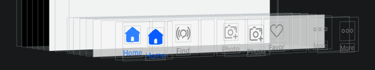
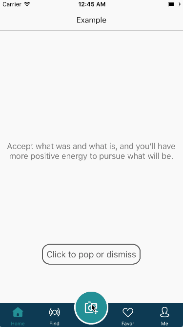
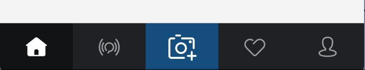

[](#swift-package-manager)
[](https://github.com/Carthage/Carthage)
[](http://cocoapods.org/pods/SPTabBarController-swift)
[](https://developer.apple.com/swift/)

### [中文介绍](README_CN.md)

**SPTabBarController** is a highly customizable TabBarController component, which is inherited from UITabBarController.

### Why?

In real-world development, we may encounter the situation of customizing the UITabBar. For instance: change font style, add animation, and use bigger items. However it's hard to do with UITabBarItem.

**With SPTabBarController, You can easily achieve these！**

-| Feature |Description
-------------|-------------|-------------
1| Default style | You can get a system-like style by initializing the TabBar with SPTabBarController directly.  </p> UITabBarController style: </p>  </p> SPTabBarController default style: </p> 
2| Default style with "More" item | If the items are more than the maximum number of displays, there will be a "More" item. </p> UITabBarController with "More": </p>  </p> SPTabBarController with "More": </p> 
3| Mix UITabBarItem and SPTabBarItem | You can set any item as you want, including UITabBarItem and SPTabBarItem. </p> SPTabBar and UITabBar mixed style: </p>  </p> SPTabBar and UITabBar mixed style with "More": </p> 
4| UIKit attributes | SPTabBarController is compatible with UITabBarController, UITabBar and UITabBarItem's most API attributes. You can migrate to SPTabBarController without any modification of the origin code.  </p> Compatible with UITabBarController's `selectedIndex`: </p> 
5| Any nesting with UINavigationController | Developing with`UITabBarController`, there are two common ways to handle layers: </p> First : </p> ├── UITabBarController </p> └──── UINavigationController </p> └────── UIViewController </p> └──────── SubviewControllers </p> Second : </p> ├── UINavigationController </p> └──── UITabBarController </p> └────── UIViewController </p> └──────── SubviewControllers </p> In the first case, need to set `hidesBottomBarWhenPushed = true` when pushing subViews. The second is not. </p> In SPTabBarController, add Container views to UITabBar to be compatible with these two ways。
6| Customizable style | With SPTabBarController, you can：</p> 1. Customize selected item's color and style: </p>  </p> 2. Add selecting animation:  </p>  </p> 3. Customize item's background color: </p>  </p> 4. Add highlight animation: </p>  </p> 5. Add animation to prompt users: </p>  </p> 6. And much more ... </p>
7| Customizable item's size </p> Customizable click event | You can easily customize item's size using SPTabBarController. </p> **When the button's frame is larger than TabBar, HitTest makes the outer TabBar area click valid.** </p> In addition, SPTabBarController can customize click event, and through a block to callback super-layer to handle. </p> With big item in the middle of TabBar: </p>  </p> With a special hint style: </p>  </p> Customize click event: </p> 
8| Default notification style |  You can get a system-like notification style by initializing the TabBar with SPTabBarController directly. </p> UITabBarController notification style: </p>  </p> SPTabBarController system-like notification style: </p> 
9| Customizable notification style | With SPTabBarController, you can：</p> 1. Customize notification animation: </p>  </p>  </p> 2. Customize prompt style: </p>  </p> 3. And much more ... </p>
10| Lottie | Through customizing ContentView, you are able to add Lottie's LAAnimationView to Item(s) </p> 

## Requirements

* Xcode 8 or later
* iOS 8.0 or later
* ARC
* Swift 5 or later

## Demo

You can download and build SPTabBarControllerExample project, and you will find more examples to use SPTabBarController, and also more examples to customize UITabBar。

## Usage

### Swift Package Manager

```
...
dependencies: [
    .package(name: "SPTabBarController", url: "https://github.com/tyronesong/SPTabBarController.git", from: "2.9.0-spm")
]
...
```


## TODO

1. The Containers' layout is purely based on code，using Autolayout will be better.
2. When there is "More," if edited, problems occur.
3. Partial UITabBarItem attributes are not bridge to SPTabBarItem.
4. ~~The picture of 'More' item in SPTabBarItemMoreContentView is not set into framework, plan to convert it to CGBitmap.~~

