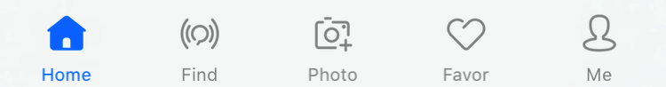
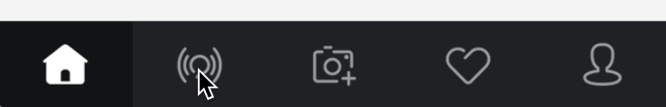
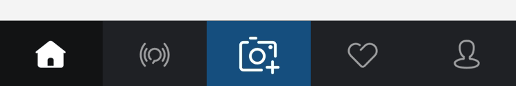
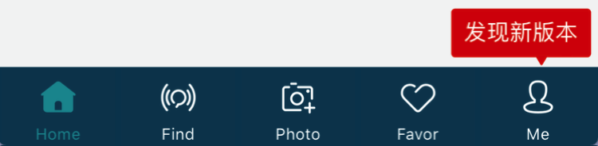
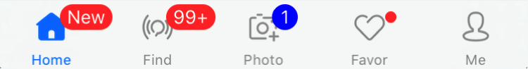

### [For English](README.md)

**SPTabBarController**是一个高度自定义的TabBarController组件，继承自UITabBarController。

### 为什么要使用?

在开发工作中，我们可能会遇到需要自定义UITabBar的情况。例如：改变文字样式、添加一些动画效果、设置一个比默认更大的样式等等，以上需求如果只通过UITabBarItem往往很难实现。

**有了SPTabBarController，你可以轻松地实现这些！**

-| 功能 |说明
-------------|-------------|-------------
1| 支持默认样式 | 如果直接使用SPTabBarController进行初始化，你会得到与UITabBarController完全相同的仿系统样式 
 UITabBarController样式: 
  
 SPTabBarController仿系统样式: 
 
2| 支持带有"More"的默认样式 | 使用SPTabBarController进行初始化，若item大于最大显示数量则显示"More"，样式与UITabBarController一致 
 带有"More"的UITabBarController样式: 
  
 带有"More"的SPTabBarController样式: 
 
3| 支持UITabBarItem和SPTabBarItem混合 | 可以任意设置tabbar的items，支持即包含UITabBarItem，同时也包含SPTabBarItem 
 SPTabBar和UITabBar混合样式: 
  
 带有'More'的SPTabBar和UITabBar混合样式: 
 
4| 支持UIKit属性 | 支持UITabBarController、UITabBar和UITabBarItem的大部分API属性，使原有代码无需任何修改即可无缝迁移到SPTabBarController 
 支持UITabBarController的`selectedIndex`属性的实现: 
 
5| 支持与UINavigationController任意嵌套 | 通常在使用`UITabBarController`过程中，会存在两种比较常见的层级处理方式: 
 第一种: 
 ├── UITabBarController 
 └──── UINavigationController 
 └────── UIViewController 
 └──────── SubviewControllers 
 第二种: 
 ├── UINavigationController 
 └──── UITabBarController 
 └────── UIViewController 
 └──────── SubviewControllers 
 第一种情况在push子视图的时候需要设置 `hidesBottomBarWhenPushed = true` , 第二种则不需要。 
 在SPTabBarController中，通过添加Container视图到UITabBar的方式来兼容这两种层级处理方式。
6| 支持自定义 | 使用SPTabBarController可以实现：
 1. 自定义选中颜色和样式 
  
 2. 添加选中时的动画效果 
  
 3. 自定义Item的背景颜色 
  
 4. 添加高亮时的动画效果 
  
 5. 添加一些动画暗示用户点击 
  
 6. 等等...... 

7| 支持自定义按钮大小 
 支持自定义点击事件 | SPTabBarController支持自定义按钮的大小，你可以轻松定制不规则大小的tab按钮。
 **当按钮frame大于TabBar时，通过HitTest方法使其超出TabBar区域点击仍然有效。** 
 另外，SPTabBarController能够自定义点击事件，并通过一个block回调给上层处理。 
 中间带有较大按钮样式: 
  
 带有特殊提醒框样式: 
  
 自定义按钮点击事件: 
 
8| 支持默认通知样式 | 如果直接使用SPTabBarController进行初始化，你会得到与UITabBarController完全相同的仿系统通知样式 
 UITabBarController样式: 
  
 SPTabBarController仿系统样式: 
 
9| 支持自定义通知样式 | 使用SPTabBarController可以实现：
 1. 自定义提醒动画 
  
  
 2. 自定义提醒样式 
  
 3. 等等...... 

10| 支持Lottie | 通过自定义ContentView，能够添加Lottie的LAAnimationView到Item 
 

## 支持环境

* Xcode 8 or later
* iOS 8.0 or later
* ARC
* Swift 5 or later

## Demo

下载后运行SPTabBarControllerExample工程，你可以看到一些使用SPTabBarController实现的自定义TabBar的更多例子。

## 未完成的事

1. Containers的布局方式目前是纯代码布局，使用Autolayout应该会更好。
2. 当存在"More"时，若进行Edit会出现问题。
3. UITabBarItem的部分属性还没有桥接到SPTabBarItem。
4. ~~SPTabBarItemMoreContentView中的"More"图片目前还未设置到framework中，计划将它转化为创建CGBitmap的代码。~~

## 赞助

您可以通过查看我们的赞助商页面来支持该项目。 只需单击一下即可：

 <i>这则广告来自 <a href="https://tracking.gitads.io/?campaign=gitads&repo=SPTabBarController&redirect=gitads.io">GitAds</a> </i>

## 感谢

* [animated-tab-bar](https://github.com/Ramotion/animated-tab-bar) by <http://ramotion.com> 
* Example中部分图片资源来自 <http://www.iconfont.cn>

